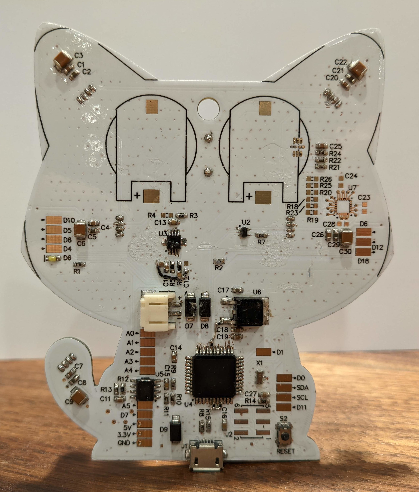

# led_cat

Arduino based circuit board in the shape of a cat...with leds

This was a project I did with my kids (3 & 6 at the time) as a way to get them interested in electrons and show they how board design works.  We did the CAD work together and they helped solder the through hole components.  This is an Arduino clone with some extra blinky blink LEDs, light sensor, accelerometer, microphone, and speaker.

